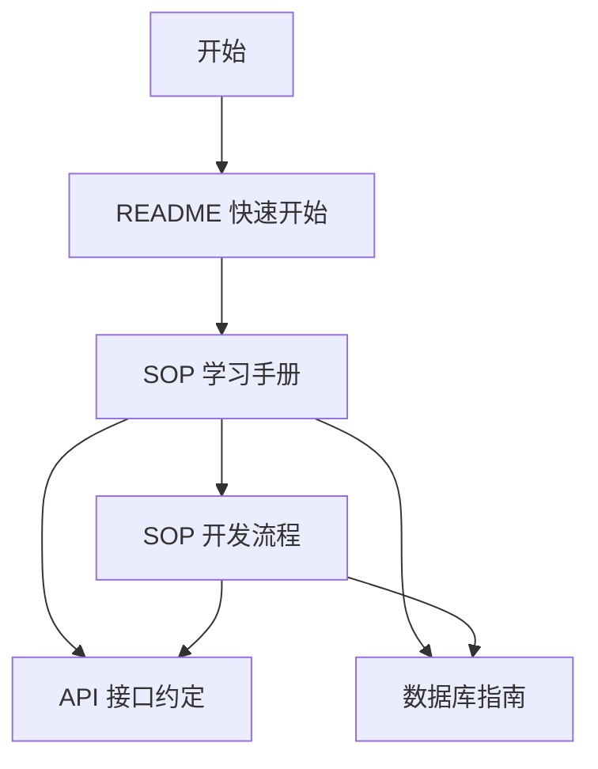

# Fancheer Backend 文档中心

> 项目全部文档索引，按推荐阅读顺序排列。

## 新手入门

| 顺序 | 文档 | 说明 |
|------|------|------|
| 0 | [项目定位与范围](./项目定位与范围.md) | 产品边界：做什么 / 不做什么 |
| 1 | [项目 README](../README.md) | 项目概述、快速开始（5 分钟跑通） |
| 2 | [SOP 学习手册](./SOP-学习手册.md) | **零基础必读**，7 天学习计划 + 12 章详解 |
| 3 | [SOP 开发流程](./SOP-开发流程.md) | 日常开发标准操作流程 |

## 参考文档

| 文档 | 说明 |
|------|------|
| [API 接口约定](./API-接口约定.md) | 认证、响应格式、错误码、分页、上传规范 + 接口速查表 |
| [数据库指南](./数据库指南.md) | Schema、迁移、Seed、Prisma Studio |
| [CHANGELOG](./CHANGELOG.md) | 历史变更记录 |
| [部署指南](./部署指南.md) | Docker Compose 一键部署、生产环境、故障排查 |

## 阅读路径

### 按角色推荐

| 你是谁 | 推荐阅读 |
|--------|----------|
| 后端新手 | README → 学习手册（7 天计划） → 开发流程 |
| 想了解 Docker | 学习手册 **§13** → 部署指南 |
| 前端开发 | README → API 接口约定 |
| 日常开发 | 开发流程 → API 接口约定 |
| 数据库变更 | 数据库指南 → 开发流程 §4 |
| 了解历史 | CHANGELOG |

## 本地文档

`word/` 目录为早期本地文档（已 gitignore），内容已迁移至本 `docs/` 目录。请以 `docs/` 为准。
