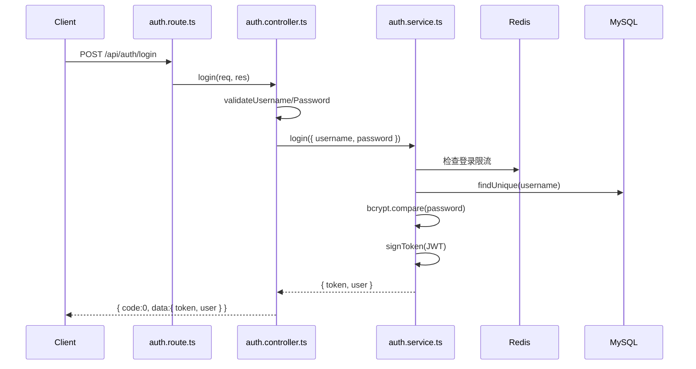
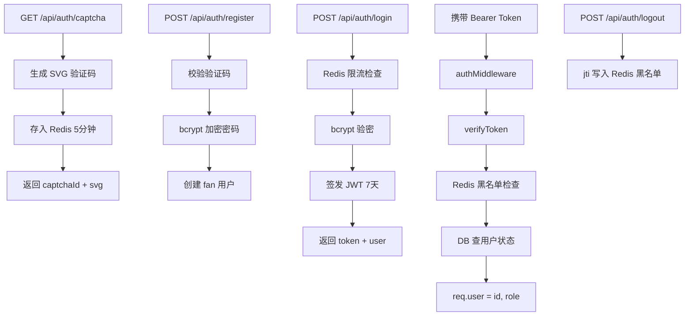

# SOP 学习手册

> Fancheer Backend 零基础后端学习指南 — 从跑通项目到独立开发。

## 如何使用本手册

1. 按 **7 天学习计划** 逐日推进，不要跳步
2. 每天「阅读 → 动手 → 复盘」三步走
3. 遇到不懂的概念，查对应章节（§1–§12）
4. 所有命令在项目根目录执行

---

## 7 天学习计划

| 天数 | 主题 | 阅读 | 动手练习 |
|------|------|------|----------|
| Day 1 | 项目启动与环境 | §1 + README | 跑通 dev，调 health 接口 |
| Day 2 | 请求生命周期 | §2–§4 | Postman 走一遍 login 全流程 |
| Day 3 | 认证与权限 | §5 | 用 fan/admin/streamer 分别调 admin 接口 |
| Day 4 | 数据库与 Prisma | §6 + [数据库指南](./数据库指南.md) | prisma:studio 查看表，改一条 banner |
| Day 5 | 聊天室模块 | §4（chat 为例） | 发公开/私密消息，点赞，举报 |
| Day 6 | 管理后台 CRUD | §11 + banner 源码 | 走一遍 Banner 增删改查 |
| Day 7 | 安全与基建 | §7–§9 | 触发限流和敏感词拦截 |

---

## §1 项目是什么

### 业务场景

Fancheer 是一个**主播粉丝互动平台**的后端 API，支撑以下前端功能：

| 模块 | 用户可见功能 |
|------|-------------|
| 首页展示 | Banner 轮播、主播资料、获奖记录、音乐、活动、图集、关系图谱 |
| 用户中心 | 注册/登录、修改昵称、选择头像、每日打卡 |
| 聊天室 | 公开聊天、私密消息、点赞、举报、主播回复 |
| 管理后台 | 用户管理、内容 CRUD、举报处理、敏感词、操作日志 |

### 模块地图

```
fancheer-backend/
├── auth        认证（验证码、注册、登录、JWT）
├── user        用户资料（昵称、头像）
├── banner      首页轮播
├── streamer    主播资料
├── awards      获奖记录
├── songs       音乐作品
├── activities  活动日历
├── gallery     图集（二次元/三次元）
├── graph       关系图谱
├── chat        聊天室（消息、点赞、举报、回复）
├── checkin     每日打卡
├── reports     举报工单
├── admin       管理后台
├── upload      文件上传
└── health      健康检查
```

### 三种角色

| 角色 | 英文标识 | 权限 |
|------|----------|------|
| 粉丝 | fan | 浏览 + 聊天 + 打卡 + 个人中心 |
| 管理员 | admin | 粉丝权限 + 管理后台 + 上传 |
| 主播 | streamer | 管理员权限 + 查看私密消息 + 设置管理员 |

---

## §2 技术栈速览

| 技术 | 作用 | 为什么用它 |
|------|------|-----------|
| **Node.js** | JavaScript 运行时 | 前后端统一语言，生态丰富 |
| **Express 5** | Web 框架 | 路由、中间件，轻量灵活 |
| **TypeScript** | 类型安全 | 编译期发现错误，IDE 智能提示 |
| **Prisma 7** | ORM | 类型安全的数据库操作，自动迁移 |
| **MySQL** | 关系型数据库 | 持久化存储用户、消息、内容 |
| **Redis** | 内存缓存 | 验证码、限流、JWT 黑名单（**不是数据库**） |
| **JWT** | 身份认证 | 无状态 Token，前后端分离友好 |
| **bcryptjs** | 密码加密 | 单向哈希，不可逆 |
| **multer** | 文件上传 | 处理 multipart/form-data |
| **sharp** | 图片处理 | 自动压缩、调整尺寸 |

---

## §3 目录结构逐层解读

### 你应该先看哪些文件

| 顺序 | 文件 | 为什么 |
|------|------|--------|
| 1 | `src/app.ts` | 入口，了解全局中间件和路由挂载 |
| 2 | `src/routes/auth.route.ts` | 最简单的路由示例 |
| 3 | `src/controllers/auth.controller.ts` | 控制器如何校验和响应 |
| 4 | `src/services/auth.service.ts` | 业务逻辑 + 数据库 + Redis |
| 5 | `src/middlewares/auth.middleware.ts` | JWT 鉴权流程 |
| 6 | `prisma/schema.prisma` | 数据库表结构 |
| 7 | `src/config/constants.ts` | 全局常量（错误码、限流、Redis Key） |

### 各目录职责

```
src/
├── app.ts           入口：中间件 + 路由 + 启动
├── routes/          路由定义（URL → 中间件 → 控制器）
├── controllers/     控制器（校验参数 → 调 service → 返回 JSON）
├── services/        服务层（业务逻辑 + Prisma/Redis）
├── middlewares/     中间件（鉴权、角色、错误、日志）
├── config/          配置（JWT、Redis、常量）
├── utils/           工具（响应、校验、XSS、分页、ID 解析）
├── lib/prisma.ts    Prisma 客户端单例
└── types/           TypeScript 类型定义
```

**关键原则**：Route 不写业务逻辑，Controller 不写 SQL，Service 不处理 HTTP。

---

## §4 一条请求的完整旅程

以 `POST /api/auth/login` 为例：



### 代码位置标注

1. **路由** — `src/routes/auth.route.ts`
   ```typescript
   router.post('/login', login)
   ```

2. **控制器** — `src/controllers/auth.controller.ts`
   - 校验 username/password 格式
   - 调用 `authService.login()`
   - 返回 `res.json(success(result))`

3. **服务** — `src/services/auth.service.ts`
   - Redis 检查登录限流（60s）
   - Prisma 查用户 + bcrypt 验密
   - JWT 签发（7 天有效期）
   - 失败抛 `AppError`

4. **响应** — `src/utils/response.ts`
   ```typescript
   success(data) → { code: 0, msg: 'success', data }
   fail(msg, code) → { code, msg, data: null }
   ```

### 中间件执行顺序（`src/app.ts`）

```
请求进入
  → requestLogger（日志）
  → cors（跨域）
  → express.json（解析 JSON body）
  → 业务路由（可能经过 authMiddleware → requireRole）
  → errorHandler（捕获 AppError）
响应返回
```

---

## §5 认证体系详解

### 完整流程



### JWT 结构

Payload 包含：
- `userId` — 用户 ID（字符串）
- `role` — 角色（fan/admin/streamer）
- `jti` — 唯一标识（用于登出黑名单）

### 角色权限矩阵

| 接口类型 | fan | admin | streamer | 游客 |
|----------|-----|-------|----------|------|
| 首页展示 GET | ✅ | ✅ | ✅ | ✅ |
| 注册/登录 | ✅ | ✅ | ✅ | ✅ |
| 聊天/打卡 | ✅ | ✅ | ✅ | ❌ |
| 管理后台 | ❌ | ✅ | ✅ | ❌ |
| 上传文件 | ❌ | ✅ | ✅ | ❌ |
| 查看全部私密消息 | ❌ | ❌ | ✅ | ❌ |
| 设置管理员 | ❌ | ❌ | ✅ | ❌ |
| 主播回复 | ❌ | ❌ | ✅ | ❌ |

---

## §6 数据库模型

详见 [数据库指南](./数据库指南.md)。

### 核心关系

- **users** 是中心表，关联 messages、likes、check_ins、reports、admin_logs
- **messages** 通过 type 区分 public/private
- **private_replies** 连接 message、streamer、target_user
- **graph_characters** + **graph_relations** 构成关系图谱

### 命名转换

| 数据库（snake_case） | API（camelCase） |
|---------------------|------------------|
| image_url | imageUrl |
| created_at | createdAt |
| sort_order | sortOrder |
| is_visible | isVisible |

转换在 Service 层完成，Controller 和前端只看到 camelCase。

---

## §7 响应与错误处理

### 三层协作

```
Controller: res.json(fail('参数错误', 400))     ← 校验失败，直接返回
Service:    throw new AppError('用户不存在', 404) ← 业务异常，抛出
Middleware: errorHandler 捕获 AppError          ← 统一格式化响应
```

### 错误码

| code | 含义 |
|------|------|
| 0 | 成功 |
| 400 | 参数错误 |
| 401 | 未登录 / Token 无效 |
| 403 | 无权限 / 账号封禁 |
| 404 | 资源不存在 |
| 409 | 冲突（如用户名重复） |
| 429 | 请求过于频繁 |
| 500 | 服务器错误 |

**重要**：HTTP 状态码始终为 200，前端通过 body 中的 `code` 判断成败。

---

## §8 Redis 使用场景

Redis 在本项目中**只做缓存和临时状态**，不存储业务数据。

| 场景 | Key 格式 | TTL | 说明 |
|------|----------|-----|------|
| 图形验证码 | `{uuid}:svg_captcha` | 300s | 注册时校验，用后删除 |
| JWT 黑名单 | `jwt_blacklist:{jti}` | 至 Token 过期 | 登出后 Token 失效 |
| 登录限流 | `rate_limit:login:{username}` | 60s | 密码错误后冷却 |
| 消息限流 | `rate_limit:msg:{userId}` | 20s | 防止刷屏 |
| 点赞幂等 | `like:add/remove:{userId}:{msgId}` | 1s | 防重复点击 |

定义位置：`src/config/constants.ts` 的 `REDIS_KEYS`。

---

## §9 文件上传流程

```
Client 发送 multipart/form-data
  → upload.route.ts（multer 内存存储，大小限制）
  → upload.controller.ts（校验 category 白名单）
  → upload.service.ts
      图片：sharp 压缩 → 写入 uploads/{category}/{uuid}.jpg
      音频：直接写入 uploads/audio/{uuid}.{ext}
  → 返回 { url: "/uploads/..." }
  → 前端通过 http://localhost:3000/uploads/... 访问
```

限制：
- 图片：10MB，jpg/png/webp/gif，压缩至 80% 质量
- 音频：50MB，mp3/wav/ogg
- 权限：admin 或 streamer

---

## §10 动手实验清单

以下实验使用 curl 或 Postman。Base URL：`http://localhost:3000`

### 实验 1：健康检查

```bash
curl http://localhost:3000/api/health
```

### 实验 2：获取验证码

```bash
curl http://localhost:3000/api/auth/captcha
```

记录返回的 `captchaId`，查看 SVG 图片辨认验证码文字。

### 实验 3：注册用户

```bash
curl -X POST http://localhost:3000/api/auth/register \
  -H "Content-Type: application/json" \
  -d '{
    "username": "fan002",
    "password": "123456",
    "captchaId": "你的captchaId",
    "captchaText": "验证码文字"
  }'
```

### 实验 4：登录获取 Token

```bash
curl -X POST http://localhost:3000/api/auth/login \
  -H "Content-Type: application/json" \
  -d '{"username": "fan001", "password": "123456"}'
```

记录返回的 `token`。

### 实验 5：获取当前用户信息

```bash
curl http://localhost:3000/api/auth/me \
  -H "Authorization: Bearer 你的token"
```

### 实验 6：发送公开消息

```bash
curl -X POST http://localhost:3000/api/messages \
  -H "Authorization: Bearer 你的token" \
  -H "Content-Type: application/json" \
  -d '{"content": "你好 Fancheer！", "type": "public"}'
```

### 实验 7：发送私密消息

```bash
curl -X POST http://localhost:3000/api/messages \
  -H "Authorization: Bearer 你的token" \
  -H "Content-Type: application/json" \
  -d '{"content": "主播加油！", "type": "private"}'
```

### 实验 8：admin 封禁用户

先用 admin 登录获取 token，然后：

```bash
curl -X PUT http://localhost:3000/api/admin/users/3/ban \
  -H "Authorization: Bearer admin的token"
```

### 实验 9：streamer 回复私密消息

先用 streamer 登录，获取私密消息 ID 后：

```bash
curl -X POST http://localhost:3000/api/messages/消息ID/private-reply \
  -H "Authorization: Bearer streamer的token" \
  -H "Content-Type: application/json" \
  -d '{"content": "谢谢你的支持！"}'
```

### 实验 10：每日打卡

```bash
curl -X POST http://localhost:3000/api/checkin \
  -H "Authorization: Bearer fan的token"
```

再次调用会返回「今日已打卡」。

---

## §11 如何自己加一个功能

参考 [SOP 开发流程](./SOP-开发流程.md) 的四步 SOP：

1. **Service** — 写 Prisma 查询和业务逻辑
2. **Controller** — 校验参数、调 service、返回 JSON
3. **Route** — 绑定路径和中间件
4. **app.ts** — 注册路由

### 推荐练习

尝试新增 `GET /api/checkin/stats`（获取用户累计打卡天数）：

- [ ] 在 `checkin.service.ts` 添加 `getCheckinStats(userId)` 方法
- [ ] 在 `checkin.controller.ts` 添加控制器
- [ ] 在 `checkin.route.ts` 添加路由（需 authMiddleware）
- [ ] Postman 测试
- [ ] 更新 API 文档

---

## §12 常见问题 FAQ

### Q: 启动报 JWT_SECRET 未配置？

A: 复制 `.env.example` 为 `.env`，设置 `JWT_SECRET=任意字符串`。

### Q: Prisma Client 找不到？

A: 运行 `pnpm prisma:gen`。

### Q: Redis 连接失败？

A: 确认 Redis 已启动。Windows 可用 WSL 或 Redis for Windows。

### Q: seed 后数据没了？

A: `pnpm seed` 会先清空所有表再导入，这是预期行为。

### Q: 为什么 HTTP 总是 200？

A: 项目约定所有响应 HTTP 200，通过 body 的 `code` 区分成功/失败。详见 §7。

### Q: 怎么查看数据库里的数据？

A: 运行 `pnpm prisma:studio`，浏览器可视化操作。不要用 Redis 查看。

### Q: 前端怎么对接？

A: 阅读 [API 接口约定](./API-接口约定.md)，重点关注认证头、响应格式、错误码。

### Q: word/ 目录是什么？

A: 早期本地文档目录（已 gitignore）。现在统一使用 `docs/` 目录。

---

## 相关文档

| 文档 | 用途 |
|------|------|
| [SOP 开发流程](./SOP-开发流程.md) | 日常开发标准流程 |
| [API 接口约定](./API-接口约定.md) | 前后端对接规范 |
| [数据库指南](./数据库指南.md) | Schema、迁移、Seed |
| [CHANGELOG](./CHANGELOG.md) | 历史变更记录 |
| [项目 README](../README.md) | 项目入口与快速开始 |
