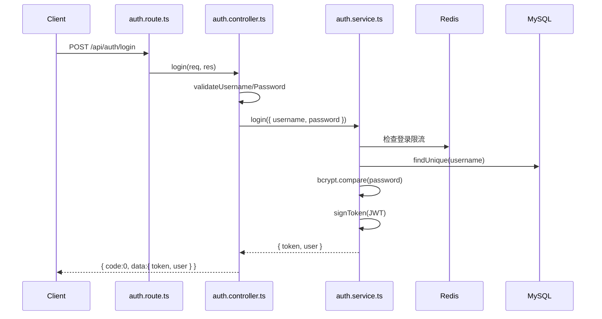
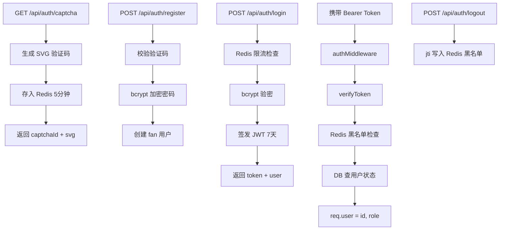
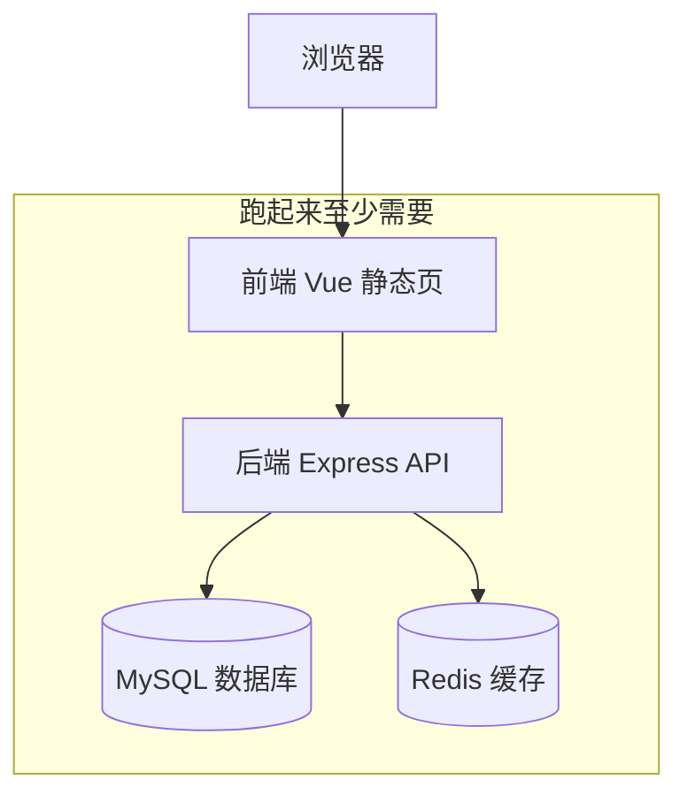

# SOP 学习手册

> Fancheer Backend 零基础后端学习指南 — 从跑通项目到独立开发。

## 如何使用本手册

1. 按 **7 天学习计划** 逐日推进，不要跳步
2. 每天「阅读 → 动手 → 复盘」三步走
3. 遇到不懂的概念，查对应章节（§1–§13）
4. 所有命令在项目根目录执行

---

## 7 天学习计划

| 天数 | 主题 | 阅读 | 动手练习 |
|------|------|------|----------|
| Day 1 | 项目启动与环境 | §1 + README | 跑通 dev，调 health 接口 |
| Day 2 | 请求生命周期 | §2–§4 | Postman 走一遍 login 全流程 |
| Day 3 | 认证与权限 | §5 | 用 fan/admin/streamer 分别调 admin 接口 |
| Day 4 | 数据库与 Prisma | §6 + [数据库指南](./数据库指南.md) | prisma:studio 查看表，改一条 banner |
| Day 5 | 留言互动模块 | §4（chat 为例） | 发公开/私密留言，点赞，举报 |
| Day 6 | 管理后台 CRUD | §11 + banner 源码 | 走一遍 Banner 增删改查 |
| Day 7 | 安全与基建 | §7–§9 | 触发限流和敏感词拦截 |
| 可选 | Docker 与部署 | §13 + [部署指南](./部署指南.md) | 用 Docker 一键跑全栈，理解镜像/容器/Compose |

> **Day 1–7 用 `pnpm dev` 学后端即可，不必先装 Docker。** Docker 适合「不想手动装 MySQL/Redis」或「模拟线上环境」时再学，见 §13。

---

## §1 项目是什么

### 业务场景

Fancheer 是一个**博主个人展示站**的后端 API —— 为单一创作者提供个人主页与轻量互动，**不是**直播平台或多主播社区。

| 模块 | 用户可见功能 |
|------|-------------|
| 首页展示 | Banner、博主资料、荣誉记录、音乐、活动、图集、关系图谱 |
| 用户中心 | 注册/登录、修改昵称、选择头像、每日打卡 |
| 留言互动 | 公开留言、私密留言、点赞、举报、博主回复 |
| 管理后台 | 用户管理、内容 CRUD、举报处理、敏感词、操作日志 |

**不开发**：多主播、直播推流、打赏、电商。详见 [项目定位与范围](./项目定位与范围.md)。

### 模块地图

```
fancheer-backend/
├── auth        认证（验证码、注册、登录、JWT）
├── user        用户资料（昵称、头像）
├── banner      首页轮播
├── streamer    博主资料（代码名 streamer_info）
├── awards      获奖记录
├── songs       音乐作品
├── activities  活动日历
├── gallery     图集（二次元/三次元）
├── graph       关系图谱
├── chat        留言互动（消息、点赞、举报、回复）
├── checkin     每日打卡
├── reports     举报工单
├── admin       管理后台
├── upload      文件上传
└── health      健康检查
```

### 三种角色

| 角色 | 代码标识 | 权限 |
|------|----------|------|
| 注册访客 | fan | 浏览 + 留言 + 打卡 + 个人中心 |
| 协管员 | admin | 访客权限 + 管理后台 + 上传 |
| 博主/站主 | streamer | 协管员权限 + 查看私密留言 + 设置协管员 |

---

## §2 技术栈速览

| 技术 | 作用 | 为什么用它 |
|------|------|-----------|
| **Node.js** | JavaScript 运行时 | 前后端统一语言，生态丰富 |
| **Express 5** | Web 框架 | 路由、中间件，轻量灵活 |
| **TypeScript** | 类型安全 | 编译期发现错误，IDE 智能提示 |
| **Prisma 7** | ORM | 类型安全的数据库操作，自动迁移 |
| **MySQL** | 关系型数据库 | 持久化存储用户、消息、内容 |
| **Redis** | 内存缓存 | 验证码、限流、JWT 黑名单（**不是数据库**） |
| **JWT** | 身份认证 | 无状态 Token，前后端分离友好 |
| **bcryptjs** | 密码加密 | 单向哈希，不可逆 |
| **multer** | 文件上传 | 处理 multipart/form-data |
| **sharp** | 图片处理 | 自动压缩、调整尺寸 |
| **Docker** | 容器化部署 | 把应用和依赖打包，一键启动，环境一致（见 §13） |

---

## §3 目录结构逐层解读

### 你应该先看哪些文件

| 顺序 | 文件 | 为什么 |
|------|------|--------|
| 1 | `src/app.ts` | 入口，了解全局中间件和路由挂载 |
| 2 | `src/routes/auth.route.ts` | 最简单的路由示例 |
| 3 | `src/controllers/auth.controller.ts` | 控制器如何校验和响应 |
| 4 | `src/services/auth.service.ts` | 业务逻辑 + 数据库 + Redis |
| 5 | `src/middlewares/auth.middleware.ts` | JWT 鉴权流程 |
| 6 | `prisma/schema.prisma` | 数据库表结构 |
| 7 | `src/config/constants.ts` | 全局常量（错误码、限流、Redis Key） |

### 各目录职责

```
src/
├── app.ts           入口：中间件 + 路由 + 启动
├── routes/          路由定义（URL → 中间件 → 控制器）
├── controllers/     控制器（校验参数 → 调 service → 返回 JSON）
├── services/        服务层（业务逻辑 + Prisma/Redis）
├── middlewares/     中间件（鉴权、角色、错误、日志）
├── config/          配置（JWT、Redis、常量）
├── utils/           工具（响应、校验、XSS、分页、ID 解析）
├── lib/prisma.ts    Prisma 客户端单例
└── types/           TypeScript 类型定义
```

**关键原则**：Route 不写业务逻辑，Controller 不写 SQL，Service 不处理 HTTP。

---

## §4 一条请求的完整旅程

以 `POST /api/auth/login` 为例：



### 代码位置标注

1. **路由** — `src/routes/auth.route.ts`
   ```typescript
   router.post('/login', login)
   ```

2. **控制器** — `src/controllers/auth.controller.ts`
   - 校验 username/password 格式
   - 调用 `authService.login()`
   - 返回 `res.json(success(result))`

3. **服务** — `src/services/auth.service.ts`
   - Redis 检查登录限流（60s）
   - Prisma 查用户 + bcrypt 验密
   - JWT 签发（7 天有效期）
   - 失败抛 `AppError`

4. **响应** — `src/utils/response.ts`
   ```typescript
   success(data) → { code: 0, msg: 'success', data }
   fail(msg, code) → { code, msg, data: null }
   ```

### 中间件执行顺序（`src/app.ts`）

```
请求进入
  → requestLogger（日志）
  → cors（跨域）
  → express.json（解析 JSON body）
  → 业务路由（可能经过 authMiddleware → requireRole）
  → errorHandler（捕获 AppError）
响应返回
```

---

## §5 认证体系详解

### 完整流程



### JWT 结构

Payload 包含：
- `userId` — 用户 ID（字符串）
- `role` — 角色（fan/admin/streamer）
- `jti` — 唯一标识（用于登出黑名单）

### 角色权限矩阵

| 接口类型 | fan | admin | streamer | 游客 |
|----------|-----|-------|----------|------|
| 首页展示 GET | ✅ | ✅ | ✅ | ✅ |
| 注册/登录 | ✅ | ✅ | ✅ | ✅ |
| 聊天/打卡 | ✅ | ✅ | ✅ | ❌ |
| 管理后台 | ❌ | ✅ | ✅ | ❌ |
| 上传文件 | ❌ | ✅ | ✅ | ❌ |
| 查看全部私密消息 | ❌ | ❌ | ✅ | ❌ |
| 设置管理员 | ❌ | ❌ | ✅ | ❌ |
| 博主回复 | ❌ | ❌ | ✅ | ❌ |

---

## §6 数据库模型

详见 [数据库指南](./数据库指南.md)。

### 核心关系

- **users** 是中心表，关联 messages、likes、check_ins、reports、admin_logs
- **messages** 通过 type 区分 public/private
- **private_replies** 连接 message、streamer、target_user
- **graph_characters** + **graph_relations** 构成关系图谱

### 命名转换

| 数据库（snake_case） | API（camelCase） |
|---------------------|------------------|
| image_url | imageUrl |
| created_at | createdAt |
| sort_order | sortOrder |
| is_visible | isVisible |

转换在 Service 层完成，Controller 和前端只看到 camelCase。

---

## §7 响应与错误处理

### 三层协作

```
Controller: res.json(fail('参数错误', 400))     ← 校验失败，直接返回
Service:    throw new AppError('用户不存在', 404) ← 业务异常，抛出
Middleware: errorHandler 捕获 AppError          ← 统一格式化响应
```

### 错误码

| code | 含义 |
|------|------|
| 0 | 成功 |
| 400 | 参数错误 |
| 401 | 未登录 / Token 无效 |
| 403 | 无权限 / 账号封禁 |
| 404 | 资源不存在 |
| 409 | 冲突（如用户名重复） |
| 429 | 请求过于频繁 |
| 500 | 服务器错误 |

**重要**：HTTP 状态码始终为 200，前端通过 body 中的 `code` 判断成败。

---

## §8 Redis 使用场景

Redis 在本项目中**只做缓存和临时状态**，不存储业务数据。

| 场景 | Key 格式 | TTL | 说明 |
|------|----------|-----|------|
| 图形验证码 | `{uuid}:svg_captcha` | 300s | 注册时校验，用后删除 |
| JWT 黑名单 | `jwt_blacklist:{jti}` | 至 Token 过期 | 登出后 Token 失效 |
| 登录限流 | `rate_limit:login:{username}` | 60s | 密码错误后冷却 |
| 消息限流 | `rate_limit:msg:{userId}` | 20s | 防止刷屏 |
| 点赞幂等 | `like:add/remove:{userId}:{msgId}` | 1s | 防重复点击 |

定义位置：`src/config/constants.ts` 的 `REDIS_KEYS`。

---

## §9 文件上传流程

```
Client 发送 multipart/form-data
  → upload.route.ts（multer 内存存储，大小限制）
  → upload.controller.ts（校验 category 白名单）
  → upload.service.ts
      图片：sharp 压缩 → 写入 uploads/{category}/{uuid}.jpg
      音频：直接写入 uploads/audio/{uuid}.{ext}
  → 返回 { url: "/uploads/..." }
  → 前端通过 http://localhost:3000/uploads/... 访问
```

限制：
- 图片：10MB，jpg/png/webp/gif，压缩至 80% 质量
- 音频：50MB，mp3/wav/ogg
- 权限：admin 或 streamer

---

## §10 动手实验清单

以下实验使用 curl 或 Postman。Base URL：`http://localhost:3000`

### 实验 1：健康检查

```bash
curl http://localhost:3000/api/health
```

### 实验 2：获取验证码

```bash
curl http://localhost:3000/api/auth/captcha
```

记录返回的 `captchaId`，查看 SVG 图片辨认验证码文字。

### 实验 3：注册用户

```bash
curl -X POST http://localhost:3000/api/auth/register \
  -H "Content-Type: application/json" \
  -d '{
    "username": "fan002",
    "password": "123456",
    "captchaId": "你的captchaId",
    "captchaText": "验证码文字"
  }'
```

### 实验 4：登录获取 Token

```bash
curl -X POST http://localhost:3000/api/auth/login \
  -H "Content-Type: application/json" \
  -d '{"username": "fan001", "password": "123456"}'
```

记录返回的 `token`。

### 实验 5：获取当前用户信息

```bash
curl http://localhost:3000/api/auth/me \
  -H "Authorization: Bearer 你的token"
```

### 实验 6：发送公开消息

```bash
curl -X POST http://localhost:3000/api/messages \
  -H "Authorization: Bearer 你的token" \
  -H "Content-Type: application/json" \
  -d '{"content": "你好 Fancheer！", "type": "public"}'
```

### 实验 7：发送私密消息

```bash
curl -X POST http://localhost:3000/api/messages \
  -H "Authorization: Bearer 你的token" \
  -H "Content-Type: application/json" \
  -d '{"content": "博主加油！", "type": "private"}'
```

### 实验 8：admin 封禁用户

先用 admin 登录获取 token，然后：

```bash
curl -X PUT http://localhost:3000/api/admin/users/3/ban \
  -H "Authorization: Bearer admin的token"
```

### 实验 9：博主（streamer 账号）回复私密留言

先用 streamer 登录，获取私密消息 ID 后：

```bash
curl -X POST http://localhost:3000/api/messages/消息ID/private-reply \
  -H "Authorization: Bearer streamer的token" \
  -H "Content-Type: application/json" \
  -d '{"content": "谢谢你的支持！"}'
```

### 实验 10：每日打卡

```bash
curl -X POST http://localhost:3000/api/checkin \
  -H "Authorization: Bearer fan的token"
```

再次调用会返回「今日已打卡」。

---

## §11 如何自己加一个功能

参考 [SOP 开发流程](./SOP-开发流程.md) 的四步 SOP：

1. **Service** — 写 Prisma 查询和业务逻辑
2. **Controller** — 校验参数、调 service、返回 JSON
3. **Route** — 绑定路径和中间件
4. **app.ts** — 注册路由

### 推荐练习

尝试新增 `GET /api/checkin/stats`（获取用户累计打卡天数）：

- [ ] 在 `checkin.service.ts` 添加 `getCheckinStats(userId)` 方法
- [ ] 在 `checkin.controller.ts` 添加控制器
- [ ] 在 `checkin.route.ts` 添加路由（需 authMiddleware）
- [ ] Postman 测试
- [ ] 更新 API 文档

---

## §13 Docker 入门（零基础详解）

> 本章回答三个问题：**Docker 是什么？为什么要装？和 Fancheer 项目有什么关系？**  
> 操作步骤见 [部署指南](./部署指南.md)；本章侧重「弄懂概念」。

### 13.1 先用一句话理解 Docker

**Docker 把「程序 + 运行环境 + 依赖」一起打包成标准盒子（容器），在任何电脑上都能用同样方式跑起来。**

可以把它想成**集装箱**：

| 类比 | 传统部署 | Docker |
|------|----------|--------|
| 货物 | 你的 Node 代码 | 后端/前端应用 |
| 运输方式 | 每台机器自己装 Node、MySQL、Redis，版本可能不一致 | 镜像里已经带好版本，拷过去就能跑 |
| 好处 | 灵活 | **「在我电脑上能跑」→「在服务器上也能跑」** |

### 13.2 为什么 Fancheer 需要 Docker？

Fancheer 不是单个程序，而是一**套系统**：



**不用 Docker 时**（本地开发常见做法）：

1. 自己安装 MySQL/MariaDB，建库、配账号
2. 自己安装 Redis 并启动
3. 后端 `pnpm install` → 配 `.env` → `pnpm dev`
4. 前端再开一个终端 `pnpm dev`
5. 换一台电脑或给同学部署，**重复上述全部步骤**，还容易因版本不同踩坑

**用 Docker 时**：

1. 安装 [Docker Desktop](https://www.docker.com/products/docker-desktop/)（Windows/Mac）或 Linux 上的 Docker Engine
2. 复制 `.env.docker.example` → `.env.docker`，改几个密码
3. 执行一条命令：`docker compose --env-file .env.docker up -d --build`
4. Docker 会自动：拉取 MySQL/Redis 镜像、构建前后端、连好网络、初始化数据库

**所以 Docker 的用处是：简化「装环境 + 启动整套服务」，并保证大家跑的是同一套版本。**

### 13.3 学习 Docker 和学后端的关系

| 阶段 | 建议 | 原因 |
|------|------|------|
| Day 1–7 学代码 | **不必装 Docker** | 用 README 的 `pnpm dev` + 本机 MySQL/Redis 更直观，改代码立刻热重载 |
| 想一键跑全站 | 可以装 Docker | 省掉手动配库的步骤 |
| 准备上线 | 建议学 Docker | 和线上部署方式接近 |

**结论：Docker 是部署工具，不是学 Express/Prisma 的前置条件。**

### 13.4 四个核心概念（必记）

#### 1. 镜像（Image）

- **是什么**：只读模板，像「安装光盘」或「类定义」
- **例子**：`mariadb:10.11`、`redis:7-alpine`、项目里的 `Dockerfile` 构建出的 backend/frontend 镜像
- **特点**：可以反复用来创建很多容器，本身不改动

#### 2. 容器（Container）

- **是什么**：镜像运行起来的**实例**，像「正在运行的进程」
- **例子**：`docker compose ps` 里看到的 `backend-1`、`mysql-1`
- **特点**：删容器数据可能丢（除非用了卷），可以随时停、启、重建

#### 3. 数据卷（Volume）

- **是什么**：容器外的持久化存储，重启/重建容器**数据还在**
- **Fancheer 里**：
  - `mysql_data` — 用户、留言、内容等表数据
  - `redis_data` — Redis 持久化（可选）
  - `uploads_data` — 上传的图片、音频

> ⚠️ `docker compose down -v` 会**删除卷**，等于清空数据库和上传文件，仅测试环境使用。

#### 4. Docker Compose

- **是什么**：一个 YAML 文件（`docker-compose.yml`）描述**多个容器**如何一起启动
- **作用**：一条命令启动 mysql + redis + backend + frontend，并配置它们之间的网络和环境变量

### 13.5 Fancheer 的 docker-compose 里有什么？

| 服务名 | 镜像来源 | 干什么 | 对外端口 |
|--------|----------|--------|----------|
| **mysql** | 官方 MariaDB | 存所有业务数据 | 仅容器内（不暴露到本机） |
| **redis** | 官方 Redis | 验证码、限流、JWT 黑名单 | 仅容器内 |
| **backend** | 本仓库 `Dockerfile` 构建 | Express API、Prisma、上传目录 | 仅容器内 `:3000` |
| **frontend** | 前端仓库 `Dockerfile` 构建 | Nginx 提供网页，并把 `/api`、`/uploads` 转给 backend | **本机 `:8080`**（可改 `HTTP_PORT`） |

浏览器访问流程：

```
你打开 http://localhost:8080
  → frontend 容器（Nginx）返回 Vue 页面
  → 页面请求 /api/... 
  → Nginx 转发到 backend:3000
  → backend 读写 mysql、redis
```

**这和开发时 Vite 的 proxy 是同一思路**：前端只认一个域名，API 由服务器反代，避免跨域问题。

### 13.6 安装 Docker Desktop 到底装了什么？

在 Windows 上安装 [Docker Desktop](https://www.docker.com/products/docker-desktop/) 后，你得到：

| 组件 | 作用 |
|------|------|
| **Docker Engine** | 真正创建/运行容器的引擎 |
| **Docker Compose** | 解析 `docker-compose.yml`，批量启停服务 |
| **轻量 Linux 虚拟机**（WSL2） | Windows 上容器实际跑在 Linux 环境里 |

安装完成后，在 PowerShell 里能执行：

```powershell
docker --version
docker compose version
```

即表示可用。

**占用**：Docker Desktop 空闲时也会占一些内存（通常几百 MB 到 1GB+），笔记本内存紧张时可只在需要部署时打开。

### 13.7 和「手动安装」对比一张表

| 维度 | 手动装 MySQL + Redis + pnpm dev | Docker Compose |
|------|--------------------------------|----------------|
| 首次搭建 | 步骤多，易配错连接串 | 一条 compose 命令 |
| 改后端代码 | 热重载，**快** | 需重建镜像才更新容器内代码，**慢** |
| 环境一致性 | 每人 Node/MySQL 版本可能不同 | 镜像锁定版本 |
| 适合场景 | **日常开发、学代码** | **演示、测试部署、上云前验证** |
| 数据在哪 | 本机 MySQL 数据目录 | Docker 卷 `mysql_data` |

### 13.8 项目里和 Docker 相关的文件

```
fancheer-backend/
├── Dockerfile              # 如何把后端打成镜像（装依赖、编译、启动脚本）
├── docker/
│   └── entrypoint.sh       # 容器启动时：等 MySQL → prisma db push → 可选 seed → node
├── docker-compose.yml      # 四个服务的编排
├── .env.docker.example     # Compose 用的环境变量模板
└── docs/部署指南.md        # 逐步操作说明

fancheer-frontend/
├── Dockerfile              # 构建 Vue → 放进 Nginx
└── nginx.conf              # 静态文件 + /api、/uploads 反代
```

**Dockerfile** 回答：「这个服务镜像里要装什么、怎么启动？」  
**docker-compose.yml** 回答：「有哪些服务、谁连谁、端口和环境变量是什么？」

### 13.9 第一次动手（可选实验 11）

前置：已安装 Docker Desktop，且 `fancheer-backend` 与 `fancheer-frontend` 为**同级目录**。

```powershell
cd fancheer-backend
copy .env.docker.example .env.docker
# 用记事本编辑 .env.docker：至少改 JWT_SECRET、MYSQL_ROOT_PASSWORD、MYSQL_PASSWORD

docker compose --env-file .env.docker up -d --build
```

等待数分钟后：

| 检查项 | 命令或地址 |
|--------|------------|
| 容器是否都在跑 | `docker compose --env-file .env.docker ps` |
| 网站 | 浏览器打开 http://localhost:8080 |
| 健康检查 | http://localhost:8080/api/health |
| 看后端日志 | `docker compose --env-file .env.docker logs -f backend` |
| 停止全部 | `docker compose --env-file .env.docker down` |

首次若 `SEED_ON_START=true`，可用 `streamer` / `admin` / `fan001`，密码 `123456` 登录。

### 13.10 常见误解 FAQ

**Q: 装了 Docker 就不用学 Node/MySQL 了吗？**  
A: 要学。Docker 只是帮你**启动**这些组件，业务代码仍在 `src/`，数据库表结构仍在 `prisma/schema.prisma`。

**Q: Docker 里的数据库和本机 MySQL 是同一个吗？**  
A: **不是。** 容器里是独立实例，和本机 3306 端口互不影响（除非你在 compose 里特意映射端口）。

**Q: 我在 Docker 里改了代码，为什么网页没变？**  
A: 容器里是**构建时拷贝进去**的代码，不是挂载本地目录。开发请继续用 `pnpm dev`；改 Docker 部署需重新 `docker compose up --build`。

**Q: Docker 和虚拟机（VMware/VirtualBox）一样吗？**  
A: 不一样。虚拟机模拟整台电脑，很重；Docker 容器共享宿主机内核，**更轻、启动更快**，专门用来跑单个应用。

**Q: 生产环境必须用 Docker 吗？**  
A: 不必须。也可以 VPS 上手动 `pnpm build` + Nginx + systemd，见 [部署指南 § 非 Docker 部署](./部署指南.md#非-docker-部署手动)。

**Q: `pnpm docker:up` 和 `docker compose ...` 有什么区别？**  
A: 前者是 `package.json` 里写的快捷脚本，本质就是后者。

---

## §12 常见问题 FAQ

### Q: 启动报 JWT_SECRET 未配置？

A: 复制 `.env.example` 为 `.env`，设置 `JWT_SECRET=任意字符串`。

### Q: Prisma Client 找不到？

A: 运行 `pnpm prisma:gen`。

### Q: Redis 连接失败？

A: 确认 Redis 已启动。Windows 可用 WSL 或 Redis for Windows。

### Q: seed 后数据没了？

A: `pnpm seed` 会先清空所有表再导入，这是预期行为。

### Q: 为什么 HTTP 总是 200？

A: 项目约定所有响应 HTTP 200，通过 body 的 `code` 区分成功/失败。详见 §7。

### Q: 怎么查看数据库里的数据？

A: 运行 `pnpm prisma:studio`，浏览器可视化操作。不要用 Redis 查看。

### Q: 前端怎么对接？

A: 阅读 [API 接口约定](./API-接口约定.md)，重点关注认证头、响应格式、错误码。

### Q: word/ 目录是什么？

A: 早期本地文档目录（已 gitignore）。现在统一使用 `docs/` 目录。

### Q: Docker 是干什么的？我必须装吗？

A: Docker 用来**一键启动** MySQL + Redis + 前后端，环境和别人一致。**学后端代码不必先装**；想省事部署或模拟线上时再装。详见 **§13 Docker 入门** 与 [部署指南](./部署指南.md)。

### Q: Docker 启动后端口和 dev 一样吗？

A: 不完全一样。Compose 默认网站入口是 **http://localhost:8080**（Nginx）；本地 dev 是前端 `:5173`、后端 `:3001`（或 `.env` 里的 `PORT`）。

---

## 相关文档

| 文档 | 用途 |
|------|------|
| [SOP 开发流程](./SOP-开发流程.md) | 日常开发标准流程 |
| [API 接口约定](./API-接口约定.md) | 前后端对接规范 |
| [数据库指南](./数据库指南.md) | Schema、迁移、Seed |
| [项目定位与范围](./项目定位与范围.md) | 产品边界与不开发功能 |
| [项目 README](../README.md) | 项目入口与快速开始 |
| [部署指南](./部署指南.md) | Docker 操作步骤与生产运维 |
