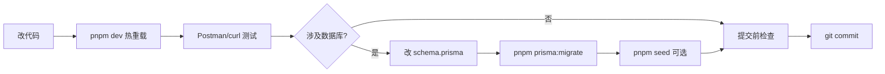

# SOP 开发流程

> Fancheer Backend 日常开发标准操作流程（Standard Operating Procedure）。

## 1. 环境初始化（一次性）

### 1.1 前置条件

| 依赖 | 版本 | 用途 |
|------|------|------|
| Node.js | 20+ | 运行时 |
| pnpm | 10+ | 包管理（项目锁定 `pnpm@10.33.2`） |
| MySQL / MariaDB | 10+ | 持久化数据 |
| Redis | 7+ | 验证码、JWT 黑名单、限流 |

### 1.2 初始化步骤

```bash
# 1. 安装依赖
pnpm install

# 2. 配置环境变量
cp .env.example .env
# 编辑 .env，至少配置 DATABASE_URL 和 JWT_SECRET

# 3. 生成 Prisma Client
pnpm prisma:gen

# 4. 创建并应用数据库迁移
pnpm prisma:migrate
# 首次运行输入迁移名，如：init

# 5. 导入种子数据（会清空所有表！）
pnpm seed

# 6. 启动开发服务器
pnpm dev
```

### 1.3 验证

浏览器或 curl 访问：

```bash
curl http://localhost:3000/api/health
```

期望返回 `mysql: ok` 和 `redis: ok`。

### 1.4 测试账号

| 用户名 | 密码 | 代码角色 | 产品称呼 |
|--------|------|----------|----------|
| admin | 123456 | admin | 协管员 |
| streamer | 123456 | streamer | 博主/站主 |
| fan001 | 123456 | fan | 注册访客 |

---

## 2. 日常开发循环



### 开发习惯

1. **保持 `pnpm dev` 运行** — nodemon + tsx 自动热重载
2. **改完即测** — 用 Postman、Apifox 或 curl 验证接口
3. **涉及 DB 先 migrate** — 不要手动改表结构
4. **小步提交** — 一个功能一个 commit

---

## 3. 新增 API 接口（四步 SOP）

项目采用 **Route → Controller → Service** 三层架构。以 Banner 模块为参考模板。

### Step 1：Service 层（业务逻辑）

文件：`src/services/xxx.service.ts`

职责：
- Prisma 数据库操作
- 业务规则校验
- 失败时 `throw new AppError('消息', 错误码)`

示例骨架：

```typescript
import { prisma } from '../lib/prisma'
import AppError from '../utils/appError'

export const getItems = async () => {
  const items = await prisma.xxx.findMany({ /* ... */ })
  // snake_case → camelCase 转换
  return items.map(item => ({
    id: item.id,
    title: item.title,
    createdAt: item.created_at
  }))
}

export const createItem = async (data: CreateInput, adminId: bigint) => {
  const item = await prisma.xxx.create({ data: { /* ... */ } })
  // 写入 admin_logs（管理操作）
  await prisma.admin_logs.create({
    data: {
      admin_id: adminId,
      action: 'create_xxx',
      target_type: 'xxx',
      target_id: item.id
    }
  })
  return { id: item.id }
}

export default { getItems, createItem }
```

### Step 2：Controller 层（参数校验 + 响应）

文件：`src/controllers/xxx.controller.ts`

职责：
- 解析/校验请求参数（`validate.ts`、`parsePagination`）
- XSS 过滤（`sanitize()`）、敏感词检查（`checkSensitiveWord()`）
- 调用 service，返回 `success()` 或 `fail()`

示例骨架：

```typescript
import { Response } from 'express'
import { UserRequest } from '../types'
import { success, fail } from '../utils/response'
import { sanitize } from '../utils/sanitize'
import { parseId, userIdFromRequest } from '../utils/id'
import xxxService from '../services/xxx.service'

export const getItems = async (_req: UserRequest, res: Response) => {
  const result = await xxxService.getItems()
  return res.json(success(result))
}

export const createItem = async (req: UserRequest, res: Response) => {
  const { title } = req.body
  if (!title) return res.json(fail('标题不能为空', 400))

  const result = await xxxService.createItem(
    { title: sanitize(title) },
    userIdFromRequest(req.user?.id)
  )
  return res.json(success(result, '创建成功'))
}
```

### Step 3：Route 层（路由 + 中间件）

文件：`src/routes/xxx.route.ts`

职责：
- 绑定 HTTP 方法与路径
- 挂载 `authMiddleware`（需登录）和 `requireRole`（需特定角色）

示例骨架：

```typescript
import { Router } from 'express'
import { authMiddleware } from '../middlewares/auth.middleware'
import { requireRole } from '../middlewares/role.middleware'
import { getItems, createItem } from '../controllers/xxx.controller'

const router = Router()

// 公开接口
router.get('/xxx', getItems)

// 管理接口
router.post('/admin/xxx',
  authMiddleware,
  requireRole(['admin', 'streamer']),
  createItem
)

export default router
```

### Step 4：注册路由

文件：`src/app.ts`

```typescript
import xxxRoutes from './routes/xxx.route'
// ...
app.use('/api', xxxRoutes)
```

### Checklist

- [ ] Service 层：Prisma 查询 + camelCase 转换 + AppError
- [ ] Controller 层：参数校验 + XSS/敏感词 + success/fail
- [ ] Route 层：正确的 authMiddleware / requireRole
- [ ] app.ts 注册路由
- [ ] 管理操作写入 admin_logs
- [ ] Postman 测试通过
- [ ] 更新 [API-接口约定.md](./API-接口约定.md)

---

## 4. 数据库变更 SOP

1. 编辑 `prisma/schema.prisma`
2. 运行 `pnpm prisma:migrate`，输入描述性迁移名
3. 确认 `generated/prisma/` 已更新（migrate 通常自动触发 gen）
4. 更新对应 service 的查询字段和类型
5. 如需测试数据，同步更新 `seed.ts`
6. 运行 `pnpm seed` 验证（**会清空数据**）

### 快速原型（不推荐生产）

```bash
pnpm exec prisma db push    # 直接同步 schema，不生成迁移文件
```

---

## 5. 常用命令速查

| 场景 | 命令 |
|------|------|
| 开发热重载 | `pnpm dev` |
| 生产构建 | `pnpm build` |
| 生产启动 | `pnpm start` |
| 生成 Prisma Client | `pnpm prisma:gen` |
| 数据库迁移 | `pnpm prisma:migrate` |
| 可视化查表 | `pnpm prisma:studio` |
| 导入种子数据 | `pnpm seed` |
| 快速同步 schema | `pnpm exec prisma db push` |
| TypeScript 编译检查 | `pnpm build` |

---

## 6. 调试与排错

### JWT 401 未认证

- 检查请求头：`Authorization: Bearer <token>`
- 确认 Token 未过期（7 天有效期）
- 确认未登出（登出后 jti 进入黑名单）
- 确认 `.env` 中 `JWT_SECRET` 与签发时一致

### Redis 连接失败

- 确认 Redis 服务已启动
- 检查 `.env` 中 `REDIS_HOST`、`REDIS_PORT`、`REDIS_PASSWORD`
- 健康检查 `GET /api/health` 查看 redis 状态

### Prisma 报错

- 先运行 `pnpm prisma:gen`
- 确认 `DATABASE_URL` 格式正确
- 确认数据库服务已启动且库已创建

### 403 无权限

- 确认当前用户角色（fan / admin / streamer）
- 部分接口仅 streamer 可访问（如设置管理员、查看全部私密消息）
- 上传接口需 admin 或 streamer 角色

### BigInt 相关

- API 返回的 ID 是字符串，不要用 `Number(id)` 解析
- 使用 `parseId(id)` 和 `userIdFromRequest(req.user?.id)`

### 上传失败

- 确认 Content-Type 为 `multipart/form-data`
- 图片 field 名：`file`，body 需带 `category`（白名单见 API 文档）
- 大小限制：图片 10MB，音频 50MB

### 限流 429

- 登录失败：60 秒冷却
- 发送消息：20 秒间隔
- 等待后重试

---

## 7. 生产部署要点

> Docker 概念入门见 [SOP 学习手册 §13](./SOP-学习手册.md#13-docker-入门零基础详解)；一键部署见 [部署指南](./部署指南.md)。

### 方式 A：Docker Compose（推荐新手部署）

```bash
cp .env.docker.example .env.docker   # 修改 JWT_SECRET、数据库密码
pnpm docker:up                       # 或 docker compose --env-file .env.docker up -d --build
```

访问 http://localhost:8080 。日常改代码仍用 `pnpm dev`，不必每次重建 Docker。

### 方式 B：手动部署（传统 VPS）

1. 设置强随机 `JWT_SECRET`
2. 配置 `CORS_ORIGIN` 为前端域名（逗号分隔）
3. 构建：`pnpm build`
4. 启动：`pnpm start`（运行 `dist/app.js`）
5. 数据库：生产环境用 `prisma migrate deploy`（非 dev）
6. **不要**在生产环境运行 `pnpm seed`

---

## 相关文档

- [SOP 学习手册](./SOP-学习手册.md) — 零基础系统学习
- [API 接口约定](./API-接口约定.md) — 前后端对接规范
- [数据库指南](./数据库指南.md) — Schema 与迁移
- [CHANGELOG](./CHANGELOG.md) — 历史变更
