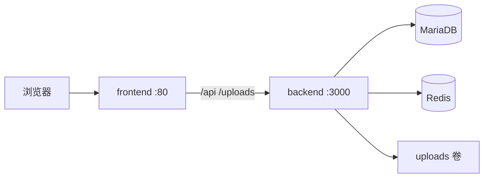

# 部署指南

> Fancheer 博主个人展示站 — Docker Compose 一键部署与生产环境说明。

## 零基础？先读这个

若还不清楚 **Docker 是什么、为什么要装、和写代码有什么关系**，请先阅读：

- **[SOP 学习手册 §13 Docker 入门](./SOP-学习手册.md#13-docker-入门零基础详解)** — 概念讲解（镜像、容器、卷、Compose）
- 本章 — 实际操作步骤

**简要结论**：Docker 不是学后端的必装项；它用来**一键启动** MySQL + Redis + 前后端，避免手动配环境，适合部署和演示。

---



| 组件 | 说明 |
|------|------|
| **frontend** | Vue 3 静态站点 + Nginx，反代 `/api`、`/uploads` 到后端 |
| **backend** | Express API，Prisma 7 + MariaDB 适配器 |
| **mysql** | MariaDB 10.11，持久化数据 |
| **redis** | Redis 7，验证码 / 限流 / JWT 黑名单 |
| **uploads 卷** | 用户上传的图片、音频 |

## 前置条件

- [Docker Desktop](https://www.docker.com/products/docker-desktop/) 或 Docker Engine + Compose v2
- 磁盘空间 ≥ 2 GB
- **目录结构**：两个仓库需为同级目录

```
Fancheer/
├── fancheer-backend/    ← 本仓库，含 docker-compose.yml
└── fancheer-frontend/
```

## 快速部署（Docker Compose）

### 1. 克隆仓库

```bash
git clone https://github.com/yanmo18/fancheer-backend.git
git clone https://github.com/yanmo18/fancheer-frontend.git
```

确保两个目录同级，例如都放在 `Fancheer/` 下。

### 2. 配置环境变量

```bash
cd fancheer-backend
cp .env.docker.example .env.docker
```

编辑 `.env.docker`，**至少修改**：

| 变量 | 说明 |
|------|------|
| `JWT_SECRET` | 强随机字符串，未配置时后端拒绝启动 |
| `MYSQL_ROOT_PASSWORD` | 数据库 root 密码 |
| `MYSQL_PASSWORD` | 应用数据库用户密码 |
| `SEED_ON_START` | 首次部署设为 `true` 写入测试账号，之后改 `false` |

生成 JWT 密钥示例：

```bash
openssl rand -base64 32
```

### 3. 构建并启动

```bash
docker compose --env-file .env.docker up -d --build
```

首次构建约 3–8 分钟（取决于网络）。启动顺序：MySQL / Redis 健康检查通过 → 后端 `prisma db push` 同步表结构 → 可选 seed → 前端 Nginx。

### 4. 访问站点

| 地址 | 说明 |
|------|------|
| http://localhost:8080 | 站点首页（端口由 `HTTP_PORT` 控制） |
| http://localhost:8080/api/health | 健康检查 |

**测试账号**（`SEED_ON_START=true` 时可用，密码均为 `123456`）：

| 用户名 | 角色 |
|--------|------|
| streamer | 站主 |
| admin | 协管员 |
| fan001 | 访客 |

### 5. 常用运维命令

```bash
# 查看状态
docker compose --env-file .env.docker ps

# 查看后端日志
docker compose --env-file .env.docker logs -f backend

# 停止
docker compose --env-file .env.docker down

# 停止并删除数据卷（危险：清空数据库与上传文件）
docker compose --env-file .env.docker down -v
```

## 环境变量说明

### Compose 层（`.env.docker`）

见 [`.env.docker.example`](../.env.docker.example)。

### 后端容器内

| 变量 | 默认值 | 说明 |
|------|--------|------|
| `PORT` | 3000 | API 监听端口（容器内） |
| `DATABASE_URL` | 由 Compose 注入 | MySQL 连接串 |
| `REDIS_HOST` | redis | Redis 主机名 |
| `JWT_SECRET` | — | **必填** |
| `CORS_ORIGIN` | http://localhost:8080 | CORS 白名单 |
| `SEED_ON_START` | false | 启动时是否执行 seed |

## 生产环境建议

### 域名与 HTTPS

Compose 默认仅暴露 HTTP。生产环境推荐：

1. 在宿主机或云负载均衡上配置 **Nginx / Caddy / Traefik** 终止 TLS
2. 将 `HTTP_PORT` 改为内网端口，或去掉 `ports` 映射，仅通过反向代理访问
3. 更新 `CORS_ORIGIN` 为实际域名，例如 `https://www.example.com`

示例 Caddy 反代（宿主机）：

```caddy
www.example.com {
    reverse_proxy localhost:8080
}
```

### 安全

- [ ] 修改所有默认密码与 `JWT_SECRET`
- [ ] `SEED_ON_START=false`（初始化完成后）
- [ ] 不要将 `.env.docker` 提交到 Git
- [ ] 定期备份 `mysql_data` 与 `uploads_data` 卷
- [ ] 生产环境禁用测试账号或修改密码

### 数据备份

```bash
# 备份数据库
docker compose --env-file .env.docker exec mysql \
  mysqldump -u root -p"$MYSQL_ROOT_PASSWORD" fancheer > backup.sql

# 备份上传目录
docker compose --env-file .env.docker cp backend:/app/uploads ./uploads-backup
```

### 数据库迁移

当前项目使用 `prisma db push` 同步 Schema（容器 entrypoint 自动执行）。

若后续引入正式迁移文件，可将 entrypoint 改为：

```bash
pnpm exec prisma migrate deploy
```

详见 [数据库指南](./数据库指南.md)。

## 非 Docker 部署（手动）

适用于已有 MySQL / Redis 的 VPS 或云主机。

### 后端

```bash
cd fancheer-backend
cp .env.example .env
# 编辑 .env：DATABASE_URL、REDIS_*、JWT_SECRET、CORS_ORIGIN、PORT

pnpm install
pnpm prisma:gen
pnpm exec prisma db push
pnpm seed          # 可选
pnpm build
pnpm start         # node dist/app.js
```

建议使用 **pm2** 或 **systemd** 守护进程，并配置 Nginx 反代 API 与 `/uploads`。

### 前端

```bash
cd fancheer-frontend
pnpm install
pnpm build
```

将 `dist/` 部署到 Nginx 静态目录，参考 [fancheer-frontend/nginx.conf](https://github.com/yanmo18/fancheer-frontend/blob/main/nginx.conf) 配置 `/api`、`/uploads` 反代。

开发模式下的 Vite proxy **不会** 出现在生产构建中，必须由 Web 服务器反代。

## 故障排查

| 现象 | 可能原因 | 处理 |
|------|----------|------|
| 后端反复重启 | MySQL 未就绪 / `DATABASE_URL` 错误 | `docker compose logs backend` |
| 502 / API 无响应 | backend 未启动 | `docker compose ps`，检查 backend 健康 |
| 登录验证码失败 | Redis 未连接 | `docker compose logs backend` 查 Redis |
| 上传失败 | 卷权限或体积超限 | 图片 ≤10MB，音频 ≤50MB |
| 前端路由 404 | Nginx 未配置 SPA fallback | 确认使用项目自带 `nginx.conf` |
| `frontend` 构建失败 | 目录不是同级 | 确认 `../fancheer-frontend` 存在 |

### 重新初始化（开发/测试环境）

```bash
docker compose --env-file .env.docker down -v
# 编辑 .env.docker：SEED_ON_START=true
docker compose --env-file .env.docker up -d --build
```

## 相关文档

- [README 快速开始](../README.md)
- [SOP 开发流程](./SOP-开发流程.md)
- [数据库指南](./数据库指南.md)
- [API 接口约定](./API-接口约定.md)
